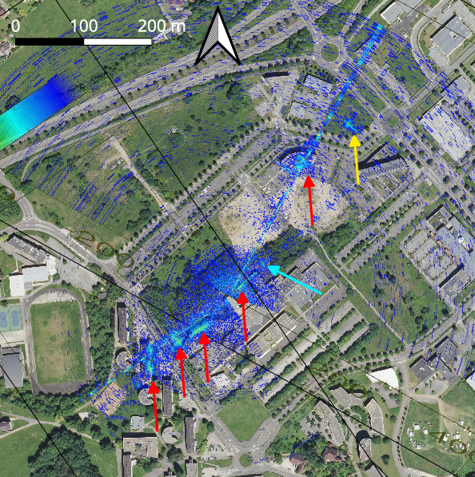
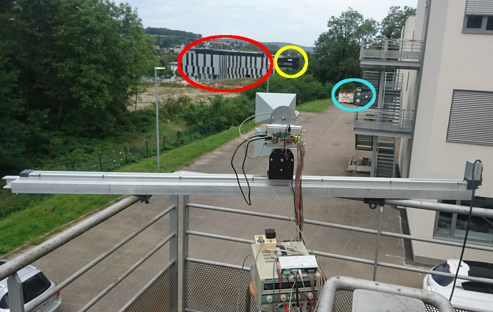

``packetspammer`` is found at https://github.com/bastibl/gr-ieee802-11/tree/maint-3.8/utils/packetspammer and
cross-compiled for the Raspberry Pi 4 (RPi4) using the Buildroot cross-compiler.

The WiFi dongle operating in monitor mode on GNU/Linux at 5.8 GHz is at 
https://github.com/aircrack-ng/rtl8812au

* ``go.sh``: start this script when launching the RPi4 to set the CPU to performance mode (1.5 GHz clock
rate), load the drivers, switch the WiFi dongle to monitor mode and start emitting continuously radio
waves
* ``monitor.sh`` is needed by go.sh, not called explicitly
* ``gbsar.py``: bring the antennas back to their rest position
* ``zeromq_demo_rev2.py``: launched in a second terminal on the RPi4 while ``go.sh`` is emitting radiofrequency
signals to collect data from the reference and surveillance channels of the B210 SDR receiver. This script
requires ``zeromq_demo_rev2_epy_module_0.py`` for running the TCP server controlling the local oscillator
frequency and antenna position from GNU Radio as generated by the GNU Radio Companion ``zeromq_demo_rev2.grc``
flowchart
* ``zeromq_left_to_right.m``: GNU Octave script running on a computer connected to the same subnet
than the RPi4. The default configuration assumes the RPi4 is assigned IP address 192.168.77.168 and
the PC is at 192.168.77.x, x!=168.
* ``go.m``: post-processing script to assemble the spectra for frequency stacking, range compression
with averaging, and azimuth compression with projection in the X-Y plane.

RADAR map overlaid on top of an aerial image of the area of interest. Notice the yellow arrow target
which is a building not yet visible on the aerial image.

Context of the experimental setup with some obvious reflectors highlighted by colored circles matching
the color encoding on the RADARgramme.
