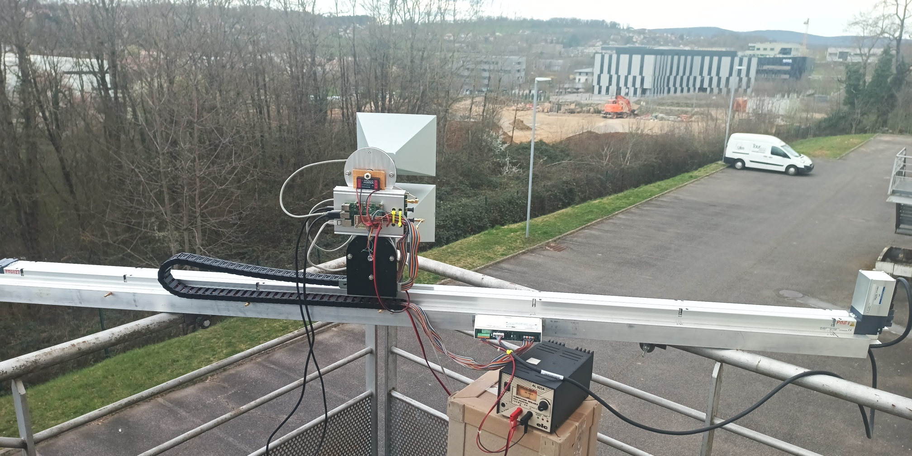

## Setup and usage manual

Securely attach the GB-SAR to whatever setup was designed, here the rail of the
emergency stairs. The bolts are fitted to avoid any risk of the rail from tilting
while the antennas are scanning along the azimuth direction:


When handling the rail **avoid touching the thin metallic sheet** holding the actuator,
which is documented by the manufacturer as **very fragile**.

Even though the GB-SAR was designed to be handled by a single person, it is probably
safer to secure the setup with two persons, one screwing the nuts on the bolts while the
other keeps the rail in place.

Setup the power: check 24-V power supply and connect the black cable to GND
and red to power: the power supply should be able to deliver at least 1-A at 24-V:


Connect the Ethernet cable from GB-SAR to the laptop. The GB-SAR is autonomous but expects
an external control computer (later called "laptop"), preferably running GNU/Linux with
GNU Octave installed for data collection and processing. The Raspberry Pi could probably
handle acquisition and processing as well but we selected a distributed architecture in this
setup.


On the laptop:
```bash
sudo ifconfig eth0 192.168.77.167
ping 192.168.77.168
```
must return
```
64 bytes from 192.168.77.168: icmp_seq=10 ttl=64 time=0.446 ms
64 bytes from 192.168.77.168: icmp_seq=11 ttl=64 time=0.211 ms
64 bytes from 192.168.77.168: icmp_seq=12 ttl=64 time=0.229 ms
```
to validate the communication between laptop and Raspberry Pi.

Connect to the Raspberry Pi from the laptop
```
ssh root@192.168.77.168
root@192.168.77.168's password: root
```
despite the ``root`` password not being echoed.

  


On the Raspberry Pi:
```
screen
./go.sh 
```
returns
```
setting interface >>wlp1s0u1u2<< to monitor channel >>100<<
Error for wireless request "Set Mode" (8B06) :
    SET failed on device wlp1s0u1u2 ; Operation not permitted.
rate 490
number 9000000
delay 2040
size 1450
repetition period is 1048575
000000^C
```
and repeating the command ``go.sh`` will lead to
```
./go.sh 
insmod: can't insert '/root/88XXau.ko': File exists
setting interface >>wlp1s0u1u2<< to monitor channel >>100<<
rate 490
number 9000000
delay 2040
size 1450
repetition period is 1048575
```
We do not mind the message about the kernel module already being loaded: the 
WiFi transmitter is now set in monitoring mode where we can control its data rate
and carrier frequency.

on another terminal (``ctrl-a c``) of the Raspberry Pi4, run
```
./gbsar.py 
```
which should move the antennas to the left-most postition. If the antenna did not
move, meaning the communication failed, run the command a second time. If the antenna
still did not move, check the electrical connections to the control box, and especially
the safety signal. When powered, the position of the antenna should only be controlled
by the Raspberry Pi and manual motion of the antenna should **not** be possible (if 
manually moving the antennas is possible, the safety signal has been disconnected).


It is probably safe to bring a soldering iron on the field when setting up the GB-SAR
in case one of the cables was broken during travel.

Once the antenna is on the left most position 


and checking on the first terminal
(``ctrl-a a``) that the WiFi signal is still being broadcast (incrementing "000000" 
displayed), run on the free terminal (again ctrl-a a to switch between the two terminals)

```bash
./zeromq_demo_rev2.py 
```

which must display
```
[INFO] [UHD] linux; GNU C++ version 11.4.0; Boost_108000; UHD_4.3.0.0-0-unknown
[INFO] [B200] Loading firmware image: /usr/share/uhd/images/usrp_b200_fw.hex...
[INFO] [B200] Detected Device: B210
[INFO] [B200] Loading FPGA image: /usr/share/uhd/images/usrp_b210_fpga.bin...
```
and then
```
[INFO] [B200] Operating over USB 3.
[INFO] [B200] Detecting internal GPSDO.... 
[INFO] [GPS] No GPSDO found
[INFO] [B200] Initialize CODEC control...
[INFO] [B200] Initialize Radio control...
[INFO] [B200] Performing register loopback test... 
[INFO] [B200] Register loopback test passed
[INFO] [B200] Performing register loopback test... 
[INFO] [B200] Register loopback test passed
[INFO] [B200] Setting master clock rate selection to 'automatic'.
[INFO] [B200] Asking for clock rate 16.000000 MHz... 
[INFO] [B200] Actually got clock rate 16.000000 MHz.
[INFO] [B200] Asking for clock rate 40.000000 MHz... 
[INFO] [B200] Actually got clock rate 40.000000 MHz.
[INFO] [MULTI_USRP]     1) catch time transition at pps edge
[INFO] [MULTI_USRP]     2) set times next pps (synchronously)
Starting server
Server running
buffer_double_mapped :warning: allocate_buffer: tried to allocate   8 items of size 8000. Due to alignment requirements   64 were allocated.  If this isn't OK, consider padding   your structure to a power-of-two bytes.   On this platform, our allocation granularity is 4096 bytes.
[INFO] [B200] Asking for clock rate 20.000000 MHz... 
[INFO] [B200] Actually got clock rate 20.000000 MHz.
Ousrp_source :error: In the last 4363 ms, 1 overflows occurred.
DD
```
and stop displaying any additional message (the Overflows O and DD might or might 
not occur).

Then on the laptop where GNU octave and its dependencies are installed
```
sudo apt install octave octave-sockets octave-signal octave-zeromq
```
from a location with enough disk space, about 1 GB will be used for each
acquisition:

```
octave -q
```
and the Raspberry Pi4 must start displaying
```
Ousrp_source :error: In the last 4363 ms, 1 overflows occurred.
DDconnected from  ('192.168.77.167', 49556)
b'z'
init all
b'0'
init freq
b'+'
b'u'
b'+'
b'u'
b'+'
b'u'
b'+'
b'u'
```
and the laptop running GNU Octave:
```
$ octave -q zeromq_left_to_right.m 
channelstart = 96
Nfreq = 22
averages = 10
maxposition = 127
maxmeas = 20
position = 1
warning: findstr is obsolete; use strfind instead
DATA LOST
DATA LOST
DATA LOST
DATA LOST
ans = 111
position = 2
DATA LOST
DATA LOST
DATA LOST
...
```

The message ``DATA LOST`` only means some WiFi emission was insufficient and the
recording had to be restarted. Files named ``1ltor.mat``, ``2ltor.mat`` and so
on will be created in the recording directory. The antenna will be moving once
every 7-seconds with 1/4 wavelength steps (1.3 cm at 5800 MHz)




At the end of the acquisition, the Raspberry Pi program quits with
```
b'+'
b'u'
b'+'
b'u'
b'r'
moving right
b'q'
Bye
```
and the GNU Octave script with
```
DATA LOST
DATA LOST
ans = 111
ans = 111
ans = 0
Elapsed time is 865.501 seconds.
```
and the antennas return to their rest position at the middle of the rail.


The Python script running on the Raspberry Pi is waiting for a new
acquisition to start: launching again ``octave -q zeromq_left_to_right.m`` on the laptop will start a new acquisition, moving the antennas to
the left-most position a recording new datasets. Make sure to save
the previous record in a sub-director since the new acquisition will
overwrite the recorded files.


Once the acquisition is completed, process with ``octave -q go.m`` or, to interact with
the resulting image, run ``go`` from an ``octave`` terminal.


Here data were collected three times and the maps are compared, with a nearby (230 m range)
building clearly visible in all data processing, and a nearby (130 m range) excavator 
probably visible as well, especially on acquisition 3. The QGis project is provided in
uncompressed format since once we figured out the right scale and orientation of the 
image, we find it easiest to edit the .qgs file with a text editor and replace the name
of the bitmap file generated by processing the GB-SAR datasets rather than graphically
performing the same operation multiple times.
