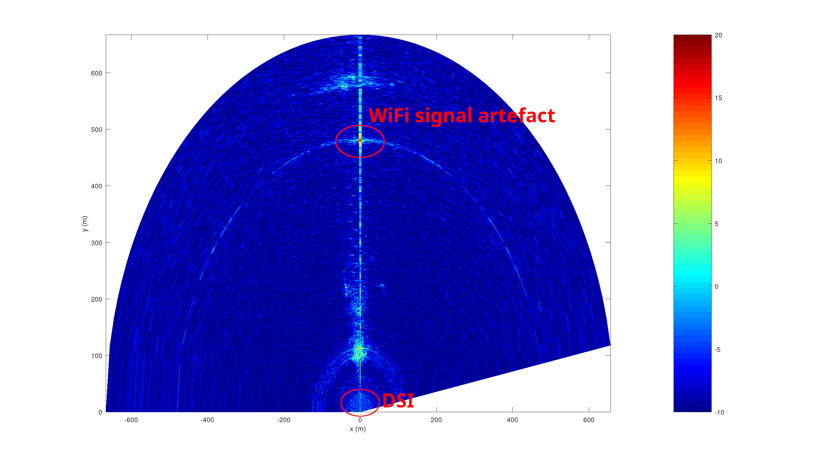
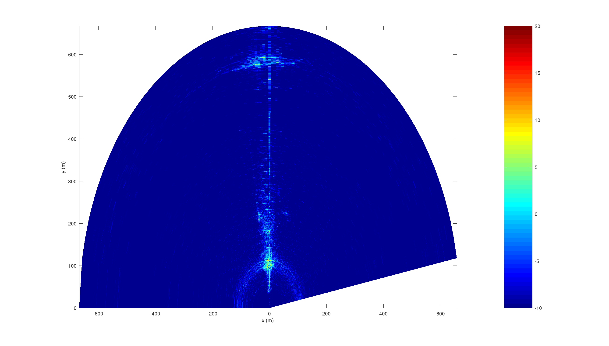

## Direct Signal Interference (DSI) removal

Since the two horn antennas are close to each other and some radiated
electromagnetic from the reference antenna will leak to the surveillance
antenna, removing this direct interference signal is desirable to 
improve signal to noise ratio and remove signal features unrelated to
targets but introduced by the WiFi signal structure (as seen on the
ambiguity function).

Direct Signal Interference (DSI) removal involved indentifying time
delayed copies of the reference signal in the surveillance signal and
cancelling this unwanted contribution by finding the appropriate weights.
The least square optimal solution is found by
* creating a matrix ``mat`` with the time delayed copies of the reference 
signal ``ref``, in the future and in the past for safety when mixing reference 
and surveillance channels (as we did when naming the variables in the ``godsi.m``
script)
```Matlab
p=1;
for m=-Ndsi:Ndsi
  if m<=0
    mat(:,p)=[ref(-m+1:end) ; zeros(-m,1)];
  else
    mat(:,p)=[zeros(m,1) ; ref(1:end-m)];
  end
  p=p+1;
end
```
* inverting the matrix: since the matrix ``mat`` is not square, the inversion
involves the pseudo inverse implemented as ``pinv()`` in GNU/Octave and Matlab.
* identifying the weights of the reference signal in the surveillance signal 
``sur`` with
``Matlab
w=pinv(mat)*sur;
``
* removing the weighted time delayed copies of the reference signal in the
surveillance signal:
``Matlab
cleaned=sur-mat*w;
``

Since we are using frequency stacking for improved range resolution, DSI
removal can be performed before or after stacking. However, the range resolution
before stacking is very poor (5 MHz bandwidth is 30 m range resolution) so
DSI removal should only involve a copy delayed by 0 or at most +/-1 sample,
cancelling reflections in the first +/-30 m of the antenna. After stacking,
the range resolution has been improved by a factor equal to the number of frequency
ranges stacked, and DSI removal in the iFFT of the stacked spectra involves longer
delays. These two conditions are set with
```Matlab
rmdsibefore=1;
rmdsiafter=0;
```
with only one or none of the options set to 1, but not both, and the related
DSI removal range is set with
```Matlab
if rmdsibefore=1
 Ndsi=1;   % 1 when DSI removal before stacking
else
 Ndsi=40;  % 40 when DSI removal after stacking
end
```

Results: no DSI removal



DSI removal before stacking


DSI removal after stacking



demonstrating clearly how the "echo" around range 480 m is an artefact of the
WiFi signal structure and not a target.

Notice that in the script, the reference ``ref`` and surveillance ``sur`` were
mixed since applying DSI removal to the original reference and surveillance order
led to the dupplication of the strong target around 100 m range, indicating the
erroneous attribution of the channels. Hence
```Matlab
reft=dsi(surt,reft,Ndsi);
```
should be
```Matlab
surt=dsi(reft,surt,Ndsi);
```
had the channels not been mixed.
