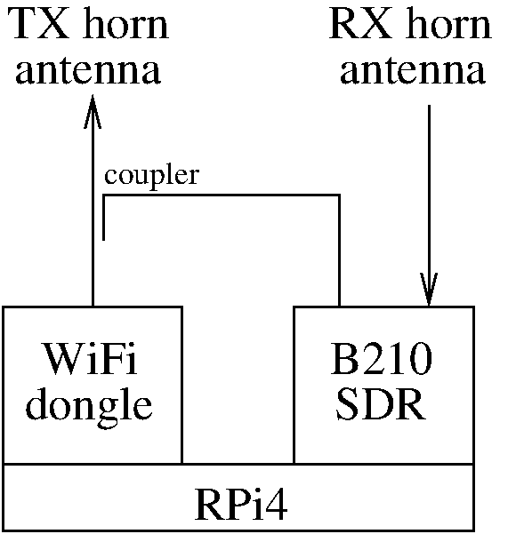

# SDR-GB-SAR

Opensource, openhardware implementation of a Software Defined Radio (SDR) Ground Based Synthetic-Aperture RADAR (GB-SAR [1])

The instrument is a Ground-Based Synthetic-Aperture-RADAR using a commercial, off the shelf WiFi dongle as pseudo-random
spectrum spread radiofrequency source, a Raspberry Pi 4 for data acquisition and antenna position control, and an Ettus
Research B210 SDR dual channel receiver for RADAR data acquisition.

The rail for moving the antenna set is a commercial, off the shelf device from <a href="https://www.iai-robot.co.jp/">IAI (Japan)</a>.

The radiofrequency signal source is an [Alfa Network AWUS036ACS](https://www.amazon.com/Network-AWUS036ACS-Wide-Coverage-Dual-Band-High-Sensitivity/dp/B0752CTSGD) WiFi USB dongle selected to cover the 5.8 GHz band and fitted with an RP-SMA antenna connector well adapted to be used, after converting [RP-SMA to SMA](https://www.digikey.fr/fr/products/detail/w%C3%BCrth-elektronik/64430203111000/10107023), to a [coupler](https://www.minicircuits.com/WebStore/dashboard.html?model=ZADC-10-63-S%2B) whose straight output feeds the horn antenna and coupled output feeds the reference channel of the [B210 SDR](https://www.ettus.com/all-products/ub210-kit/). The second input of the SDR is connected straight to the reception horn antenna.

[1] Hoonyol Lee and Jihyun Moon, Analysis of a Bistatic Ground-Based Synthetic Aperture Radar 
System and Indoor Experiments, MDPI Remote Sens. 2021, 13(1), 63; https://doi.org/10.3390/rs13010063 

## Connections

